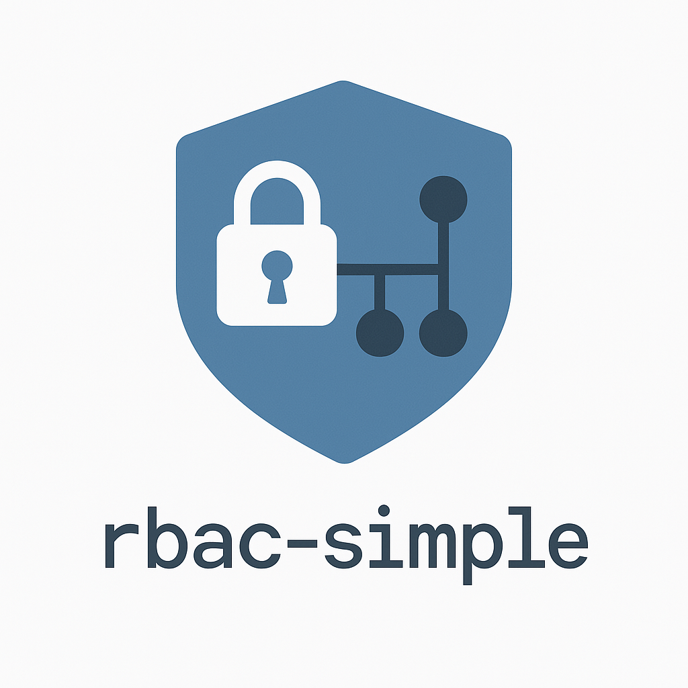

[](https://deepwiki.com/OpenSourcePKG/rbac-simple)

# rbac-simple
<p align="center">

<br><br>
rbac-simple is an implementation of a simple RBAC, a Role-Based Access Control (RBAC) system with hierarchical permissions support. The library is designed as a lightweight, zero-dependency solution for implementing access control in Node.js applications.
</p>


### Prerequisites

- NodeJS 20
- rbac-simple is an ES module: You will need to upgrade your project configuration accordingly.

### Installation

```bash
npm i --save https://github.com/OpenSourcePKG/rbac-simple
```

### Usage

If the roles and rights are static, you should define all roles and rights in two separate enums.
Internally the roles and rights are strings. So you could also feed rbac-simple with data from a database.

````typescript
import {Rbac} from '../src/rbac.js';

// define all roles
const enum Role {
  root = 'root',
  user = 'user'
}

// define all rights
const enum Right {
  contracts = 'contracts',
  contracts_delete = 'contracts_delete',
  contracts_read = 'contracts_read',
  contracts_write = 'contracts_write',
  invoices = 'invoices',
  invoices_write = 'invoices_write',
  invoices_read = 'invoices_read',
  users = 'users',
  users_read = 'users_read'
}

// create a new instance of Rbac with the enums for the roles and rights as generic parameters
const myRbac = new Rbac<Role, Right>(
// first parameter is an array with all roles
[
  Role.root,
  Role.user
],
// second parameter is an object with all rights that can be nested with subrights
{
  [Right.contracts]: {
    [Right.contracts_delete]: {},
    [Right.contracts_read]: {},
    [Right.contracts_write]: {}
  },
  [Right.invoices]: {
    [Right.invoices_read]: {},
    [Right.invoices_write]: {}
  },
  [Right.users]: {
    [Right.users_read]: {}
  }
},
// the third parameter is an object with the concrete associations between the roles and rights
// from the previous two parameters
{
  [Role.root]: [
    Right.contracts,
    Right.invoices_write,
    Right.invoices_read
  ],
  [Role.user]: [
    Right.users
  ]
});
````

You can now use `myRbac` to check if a role has a specific right like
````typescript
if (myRbac.checkAccess(Role.root, Right.users)) {
  // do the thing
} else {
  // don't do the thing
}
````

### Nested rights

rbac-simple supports nested rights so if a role has a right it automatically has all sub rights.
For instance in the above example the role `root` has the right `Right.contracts`. Checking the
right `Right.contracts_delete` or `Right.contracts_write` for role `root` will return true.
